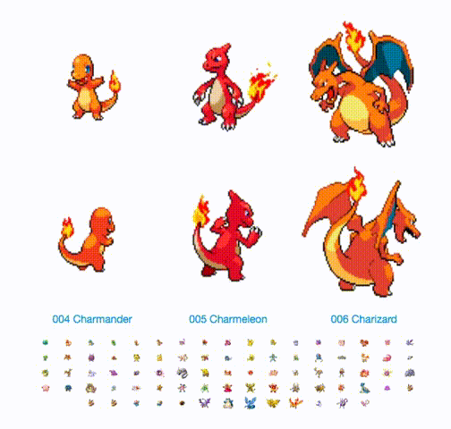

# pkmn_slickr

<!-- badges: start -->

<!-- badges: end -->

A test of [the {slickR} package](https://metrumresearchgroup.github.io/slickR/) for creating carousels with R.

You can:

* [read a blog](https://www.rostrum.blog/2020/02/05/slickr/) about this
* [see a standalone page](https://matt-dray.github.io/pkmn_slickr/) with this demo in action
* look at the gif below for a rough idea of what it does

